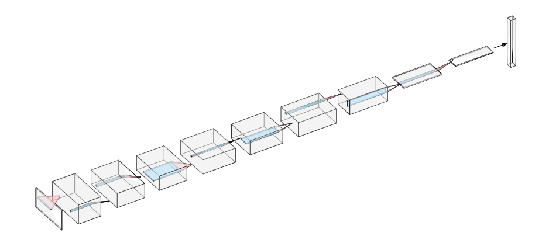
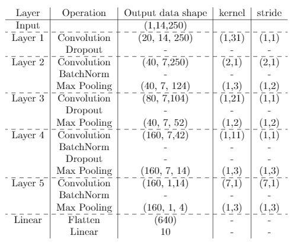
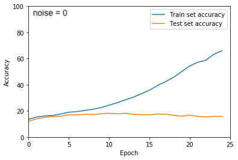
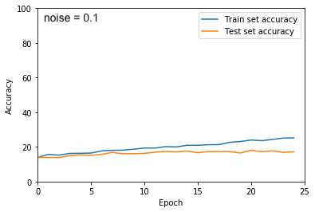

# CNN-EEG: Applying Convolutional Neural Networks to EEG signal Analysis

### Summary
The aim of this project is to build a Convolutional Neural Network (CNN) model for processing and classification of a multi-electrode electroencephalography (EEG) signal. This model was designed for incorporating EEG data collected from 7 pairs of symmetrical electrodes. The MindBigData EPOH dataset (can be downloaded from **[here](http://mindbigdata.com/opendb/MindBigData-EP-v1.0.zip)**, 2,66 GB) was used to train the models. This projects presents architectures for a multiclass (10) and binary (one-versus-all) classifiers. We used Pytorch API for bulding the CNN and the Scikit-learn library to supplement our data processing and performance analysis methods. 

### Code
* `dataLoader.py`: The dataloader that creates a Pytorch compatible tensor from the raw tab-separated txt file. Dataloader has to be ran to produce a tensor that would then be used as an input for one of 4 CNN models (convNet, lowKernelNet, thinNet, or thinNet).
* `dataLoaderNew.py`: An updated version of the dataloader that was created to streamline the process of creating the custom datasets, where one (or multiple) pairs of symmertrical channels was excluded from the original dataset. The rationale behind doing that was to check whether reducing the input size (the number of channels per example) would help to fight overfitting. 
* `convNet.py`: the main 6-layer CNN architechture
* `lowKernelNet.py` An alternative reduced architecture 
* `thinNet.py`:  An alternative reduced architecture 
* `manualGS.py`: The pipeline for training and testing the muplticlass classifier models. The script is designed in a way that makes it easier to compare the perfomance metrics for models built on different versions of the dataset (in our case, datasets with different pairs of symmetrical channels excluded). Detailed instructions on how to run the model are provided in the script file.
* `runNet.py` : The pipeline for running the autoencoder-classifier hybrid net. The script is modified to allow for the loss of both the autoencoder and the classifier to be combined for backpropagation.
* `hybridNet.py` : An alternative to convNet. The network is both an autoencoder and classifier, with the classifier using the latent space representation from the autoencoder as the input for classification. Using this hybrid architecture approach, we found that a marginal improvement to overall test set accuracy was possible.

#### Requirements
* Python 3.7 
* Pytorch 1.8
* NumPy
* Pandas
* matplotlib
* scikit-learn

### CNN architecture

  
  
   
    <em> The basic structure of the convNet class. All other networks were derivatives of convNet. </em>
 

Due to the difficulty of our dataset, all network architectures we tried had a strong tendency to begin overfitting. To combat this, we used several regularization methods. Below is the results of using data noising, where noise of the given std. dev. was added to each input channel. While noising curtailed overfitting, it also made our already noisy data that much more difficult for the network to learn, and so test set accuracy does not improve dramatically.

  
  
   
    <em> ConvNet trained with no noise and with noise of std. dev. 0.1. </em>
 

### Channel exclusion as a way to combat overfitting 
Reducing an input size could be one of the strategies for addressing the issue of overfitting. In our case, input size can be reduced by excluding several pairs of symmetrical channels. We created a custom data loader (dataLoaderNew.py) that allows us to create custom datasets containing fewer than 14 channels and a pipeline for evaluating the performance of these datasets (manualGS.py). Removing one pair of symmetrical channels at a time (which, in our case, implied reducing the input size by 1/7) narrowed the gap between the train and test set accuracies. After 30 epoch, the accuracies on the train sets got lower, while the accuracies on the test sets either remained unchanged or increased, which indicates that we were able to achieve a slight reduction in overfitting. One of the potentioal future direction for this project is reducting the input size even further by excluding more than one pair of symmetrical channels at a time. 

### Hybrid autoencoder for forced feature extraction
We experimented with an alternative network architecture combining the classifier with a convolutional autoencoder. We used the same 5 layer CNN archictecture for the first half of the autoencoder, and then designed the deconvolutional layers for the second half. Classification was made using the representational layer of the autoencoder as the input to a final linear classifying layer. The runNet file was used to run this network architecture. As the hybrid model has two different outputs, the reconstructed input and the classifier's prediction, we have two different loss values for each example fed into the network. Thus, we also experimented with how autoencoder and classifier loss should be weighted for backpropogataion in the shared convolutional layers. We found that, with the hyperparameters we found optimal in prior experimentation, weighting autoencoder loss as 2/3 of classifier loss was ideal.
